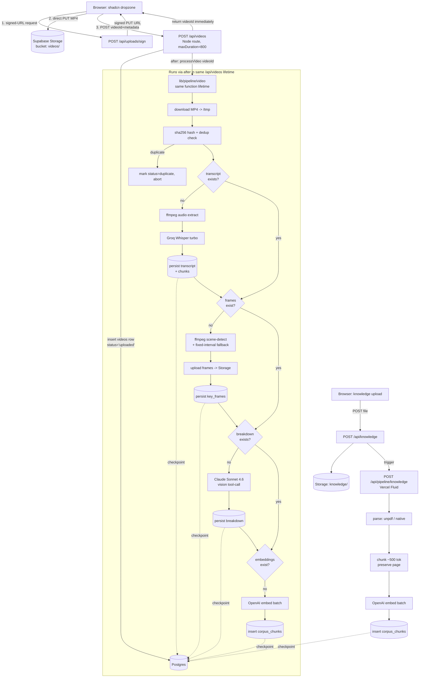

# skincare-scripter v0 — Implementation Plan

**Context.** Cameron is building a personal TikTok scripting copilot for the male-skincare niche. v0 ships *only* the corpus-building half: a video-analysis pipeline (Groq Whisper + Claude vision breakdown) and a knowledge-ingestion pipeline (PDF/MD/TXT/pasted), both feeding a single pgvector corpus that's searchable across types. Script generation is Phase 2 and must not bleed in. The repo is currently empty except for `SPEC.md`, so every path below is a new file. Stack is locked: Next.js 16 App Router, Supabase (new project), Vercel Fluid, shadcn/ui, Groq Whisper turbo, Claude Sonnet 4.6 (`claude-sonnet-4-6`), OpenAI `text-embedding-3-small` (justified below).

---

## 1. ARCHITECTURE

### Component diagram



### Where each step runs

| Step | Runtime | Reason |
|---|---|---|
| File upload | Browser → Supabase Storage direct (signed PUT) | Avoid Vercel 4.5 MB body limit on MP4s |
| Row insert + pipeline trigger | `POST /api/videos` Node route, `maxDuration = 800` | Inserts row, returns `{videoId}` immediately, then runs `processVideo()` in the same lifetime via `after()` from `next/server`. **Do not** fire-and-forget `fetch` to a separate route — Vercel can terminate the spawned request once the originating handler returns ([Vercel Functions API ref](https://vercel.com/docs/functions/functions-api-reference)). |
| Video pipeline | Same `/api/videos` route via `after()`, `runtime = 'nodejs'` | ffmpeg-static + long-running ops fit comfortably in 800s. Manual retry exposed at `POST /api/pipeline/video/retry` calling `processVideo({videoId})` directly (also via `after()`). |
| Knowledge pipeline | `POST /api/knowledge` Node route, `maxDuration = 300`, `after()` | Same pattern; no ffmpeg. |
| UI reads | RSC + Supabase client | Standard |

### Failure boundaries and checkpoints

Pipeline is **resumable by re-invocation**. Each step gates on "does my output already exist in DB?" before running. The only state lives in Postgres (`videos.status` enum + presence of child rows). No external queue.

**Triggering.** The pipeline is invoked via `import { after } from 'next/server'` inside `POST /api/videos`. The route inserts the row, returns `{videoId}` to the browser, and `after()` keeps the function lifetime open to run `processVideo({videoId})` under the route's `maxDuration = 800` budget. This is the supported Vercel pattern for post-response background work — a fire-and-forget `fetch` to a separate route is **not** reliable on Vercel because the spawned request can be terminated once the originating handler returns.

Checkpoints after: `transcripts` row inserted → `key_frames` rows inserted → `breakdowns` row inserted → `corpus_chunks` rows inserted. If the function dies mid-Claude-call, the retry button hits `POST /api/pipeline/video/retry` (also wrapped in `after()`), which calls `processVideo({videoId})` and resumes at the Claude step — Groq is not re-billed.

A `POST /api/pipeline/video/retry` exposed on the video detail page lets Cameron manually nudge a stuck/failed job.

---

## 2. SCHEMA

`db/migrations/0001_init.sql`:

```sql
create extension if not exists vector;
create extension if not exists pgcrypto;

create type pipeline_status as enum (
  'uploaded', 'transcribed', 'frames_extracted',
  'analyzed', 'embedded', 'failed', 'duplicate'
);

create type source_type as enum ('video', 'knowledge');

create table videos (
  id uuid primary key default gen_random_uuid(),
  storage_path text not null,           -- e.g. videos/{uuid}.mp4
  filename text not null,
  content_hash text,                    -- sha256 of file, for dedup
  creator_handle text,
  view_count bigint,
  posted_at date,
  niche_tag text,
  duration_seconds numeric,
  status pipeline_status not null default 'uploaded',
  error_message text,
  created_at timestamptz not null default now(),
  updated_at timestamptz not null default now()
);
create unique index on videos (content_hash) where content_hash is not null;
create index on videos (status);

create table transcripts (
  video_id uuid primary key references videos(id) on delete cascade,
  full_text text not null,
  language text,
  raw_groq_response jsonb not null,
  created_at timestamptz not null default now()
);

create table transcript_chunks (
  id uuid primary key default gen_random_uuid(),
  video_id uuid not null references videos(id) on delete cascade,
  chunk_index int not null,
  text text not null,
  t_start numeric not null,
  t_end numeric not null,
  unique (video_id, chunk_index)
);
create index on transcript_chunks (video_id, t_start);

create table key_frames (
  id uuid primary key default gen_random_uuid(),
  video_id uuid not null references videos(id) on delete cascade,
  frame_index int not null,
  t_seconds numeric not null,
  storage_path text not null,           -- frames/{videoId}/{idx}.jpg
  unique (video_id, frame_index)
);

create table breakdowns (
  video_id uuid primary key references videos(id) on delete cascade,
  hook jsonb, problem jsonb, twist jsonb, solution jsonb, cta jsonb,
  tonality text,
  authenticity_signals text[],
  pacing_notes text,
  buyer_psychology_levers text[],
  visual_style_notes text,
  male_creator_relevance text,
  raw_claude_response jsonb not null,
  model text not null,
  created_at timestamptz not null default now()
);

create table knowledge_items (
  id uuid primary key default gen_random_uuid(),
  kind text not null check (kind in ('pdf','md','txt','pasted')),
  storage_path text,                    -- null for pasted
  filename text,
  title text,
  source_label text,                    -- "Hormozi - $100M Offers"
  pasted_text text,
  status pipeline_status not null default 'uploaded',
  error_message text,
  created_at timestamptz not null default now()
);
create index on knowledge_items (status);

-- UNIFIED corpus table — recommended over per-type
create table corpus_chunks (
  id uuid primary key default gen_random_uuid(),
  source_type source_type not null,
  video_id uuid references videos(id) on delete cascade,
  knowledge_item_id uuid references knowledge_items(id) on delete cascade,
  text text not null,
  embedding vector(1536) not null,      -- OpenAI text-embedding-3-small
  t_start numeric, t_end numeric,       -- videos only
  page_number int, section_label text,  -- knowledge only
  chunk_kind text not null,             -- 'transcript' | 'breakdown_summary' | 'pdf_page' | 'md_section' | 'txt_block' | 'pasted_block'
  metadata jsonb not null default '{}', -- niche_tag, view_count, source_label denorm for ranking
  created_at timestamptz not null default now(),
  check ((video_id is not null) <> (knowledge_item_id is not null))
);
create index corpus_chunks_embedding_idx
  on corpus_chunks using hnsw (embedding vector_cosine_ops);
create index on corpus_chunks (source_type);
create index on corpus_chunks (video_id);
create index on corpus_chunks (knowledge_item_id);
create index on corpus_chunks ((metadata->>'niche_tag'));
```

**Unified vs per-type:** unified `corpus_chunks`. Single-table semantic search is dramatically simpler and the nullable columns are cheap. Per-type would force UNION ALL at query time, which kills the hnsw plan.

**RLS:** disabled (single-user). Recommended default: keep `service_role` for all pipeline writes (only the Vercel function has the key), and gate read access in the app layer via Vercel deployment protection. If Cameron ever exposes this, add a single `auth.uid() = $owner_id` policy after backfilling an `owner_id` column.

**Index choice:** hnsw not ivfflat — corpus will stay small (low thousands of chunks for a year) and hnsw gives better recall without needing to retrain on insert.

---

## 3. PIPELINE IMPLEMENTATION SPEC

### Input contract

```ts
// app/api/pipeline/video/route.ts — POST
type ProcessVideoInput = { videoId: string };
type ProcessVideoOutput = { status: PipelineStatus; resumedFrom?: PipelineStatus };
```

Pipeline is **always** called with just `videoId`. All other state lives in DB. The route is idempotent: callable any number of times.

### Pseudocode (the function in `lib/pipeline/video.ts`)

```ts
export async function processVideo({ videoId }: { videoId: string }) {
  const v = await db.videos.findOrThrow(videoId);
  const tmp = await tmpDir();                              // /tmp/{videoId}
  const localMp4 = await downloadFromStorage(v.storage_path, `${tmp}/in.mp4`);
  const duration = v.duration_seconds ?? await ffprobeDuration(localMp4);
  if (!v.duration_seconds) await db.videos.update(videoId, { duration_seconds: duration });

  // STEP 0: dedup — hash on the server, not in the browser
  if (!v.content_hash) {
    const hash = await sha256File(localMp4);              // streaming sha256, ~constant memory
    const dup = await db.videos.findByHash(hash, { excludeId: videoId, statusIn: ['embedded', 'analyzed', 'frames_extracted', 'transcribed'] });
    if (dup) {
      await db.videos.update(videoId, {
        content_hash: hash,
        status: 'duplicate',
        error_message: `duplicate of ${dup.id}`,
      });
      await fs.rm(tmp, { recursive: true, force: true });
      return { status: 'duplicate', duplicateOf: dup.id };
    }
    await db.videos.update(videoId, { content_hash: hash });
  }

  // STEP 1: transcript
  if (!await db.transcripts.existsFor(videoId)) {
    const audio = await ffmpegExtractAudio(localMp4, `${tmp}/audio.mp3`);  // 16kHz mono
    const groq  = await groq.audio.transcriptions.create({
      file: fs.createReadStream(audio),
      model: 'whisper-large-v3-turbo',
      response_format: 'verbose_json',
      timestamp_granularities: ['word'],
    });
    await db.tx(async t => {
      await t.transcripts.insert({ video_id: videoId, full_text: groq.text, language: groq.language, raw_groq_response: groq });
      await t.transcript_chunks.insertMany(chunkByWordWindow(groq.words, { maxChars: 600 }));
      await t.videos.update(videoId, { status: 'transcribed' });
    });
  }

  // STEP 2: frames
  if (!await db.key_frames.anyFor(videoId)) {
    const targetCount = frameTargetCount(duration);                          // see §4
    const stamps = await ffmpegSceneFrames(localMp4, tmp, { duration, target: targetCount });
    for (const f of stamps) {
      const storagePath = `frames/${videoId}/${String(f.idx).padStart(2,'0')}.jpg`;
      await uploadToStorage(storagePath, f.path, 'image/jpeg');
    }
    await db.tx(async t => {
      await t.key_frames.insertMany(stamps.map(f => ({ video_id: videoId, frame_index: f.idx, t_seconds: f.t, storage_path: `frames/${videoId}/${String(f.idx).padStart(2,'0')}.jpg` })));
      await t.videos.update(videoId, { status: 'frames_extracted' });
    });
  }

  // STEP 3: Claude breakdown
  if (!await db.breakdowns.existsFor(videoId)) {
    const [chunks, frames] = await Promise.all([
      db.transcript_chunks.byVideo(videoId),
      db.key_frames.byVideo(videoId),
    ]);
    const frameImages = await Promise.all(frames.map(f => downloadAsBase64(f.storage_path)));
    const result = await callClaudeBreakdown({ video: v, chunks, frames, frameImages });  // §5
    await db.tx(async t => {
      await t.breakdowns.insert({ video_id: videoId, ...result.parsed, raw_claude_response: result.raw, model: 'claude-sonnet-4-6' });
      await t.videos.update(videoId, { status: 'analyzed' });
    });
  }

  // STEP 4: embeddings
  if (!await db.corpus_chunks.anyFor(videoId)) {
    const [chunks, breakdown] = await Promise.all([
      db.transcript_chunks.byVideo(videoId),
      db.breakdowns.byVideo(videoId),
    ]);
    const items = [
      ...chunks.map(c => ({ chunk_kind: 'transcript', text: c.text, t_start: c.t_start, t_end: c.t_end })),
      { chunk_kind: 'breakdown_summary', text: renderBreakdownSummary(breakdown) },
    ];
    const vectors = await openai.embeddings.create({
      model: 'text-embedding-3-small',
      input: items.map(i => i.text),
    });
    await db.corpus_chunks.insertMany(items.map((i, idx) => ({
      source_type: 'video', video_id: videoId,
      embedding: vectors.data[idx].embedding,
      metadata: { niche_tag: v.niche_tag, view_count: v.view_count, posted_at: v.posted_at, creator_handle: v.creator_handle },
      ...i,
    })));
    await db.videos.update(videoId, { status: 'embedded' });
  }

  await fs.rm(tmp, { recursive: true, force: true });
  return { status: 'embedded' };
}
```

The route wraps this in a try/catch and on throw writes `status='failed'` + `error_message=err.stack` so the UI can surface it.

### Retry / idempotency

- **Step gating** by DB existence checks is the whole strategy. No locks needed for single-user.
- `transcripts.video_id` and `breakdowns.video_id` are PKs → re-insert would FK-violate, but the existence check prevents the API call entirely.
- `corpus_chunks` uses `anyFor(videoId)` count; if a partial embed run crashed mid-batch, manual cleanup (`delete from corpus_chunks where video_id=...`) before retry. Acceptable for v0.
- `content_hash` (sha256 of MP4) is computed **server-side as STEP 0** of the pipeline (after the MP4 is downloaded to `/tmp`). Browser-side hashing was rejected: it's slow on large MP4s and the wasted Storage write on a duplicate is cheap to throw away. If `findByHash` returns an existing in-progress or completed row, this video is marked `status='duplicate'` and the pipeline aborts — no Groq, Claude, or OpenAI calls are made.

### Vercel Fluid duration estimate (60s TikTok, 15 frames)

| Stage | Time |
|---|---|
| Storage download (~8MB) | 2-4s |
| ffmpeg audio extract | 3-5s |
| Groq Whisper turbo (60s audio) | 2-4s |
| ffmpeg scene detect + 15 JPGs | 6-10s |
| Frame uploads (parallel) | 4-8s |
| Claude vision (15 images + transcript, structured tool-call) | 18-35s |
| OpenAI embeddings (~25 chunks) | 2-4s |
| DB writes | 1-2s |
| **Total** | **~40-75s** |

Well under Fluid Pro's 800s ceiling. Hobby's 300s is also fine but recommend Pro for headroom on 2-3 min uploads.

### Cost per video (60s, 15 frames)

| Item | Calc | Cost |
|---|---|---|
| Groq Whisper turbo | $0.04/hr × (60/3600) | **$0.0007** |
| Claude Sonnet 4.6 vision | 15 imgs × ~600 tok + ~2k transcript + ~500 schema ≈ 11.5k in × $3/MTok | $0.0345 |
| Claude Sonnet 4.6 output | ~1k tok × $15/MTok | $0.015 |
| OpenAI embeddings | ~3k tok × $0.02/MTok | $0.00006 |
| Storage | ~9 MB × $0.021/GB/mo | $0.0002/mo |
| **Per video** |  | **~$0.05** |

500 videos ≈ **$25 total**. Comfortable.

---

## 4. FRAME EXTRACTION STRATEGY

**Recommendation: hybrid — scene-change primary, fixed-interval fallback, hard cap.**

ffmpeg command — single pass that emits both the JPGs *and* a parseable timestamp log via the `metadata=print` filter:

```
ffmpeg -i in.mp4 \
  -vf "select='gt(scene,0.3)+eq(n,0)',scale=768:-1,metadata=print:file=scenes.txt" \
  -vsync vfr -frames:v 30 frame_%02d.jpg
```

`scenes.txt` looks like (one block per emitted frame, in order):
```
frame:0    pts:0      pts_time:0
lavfi.scene_score=0
frame:1    pts:74000  pts_time:2.467
lavfi.scene_score=0.412
...
```

The Nth `pts_time` block corresponds to `frame_NN.jpg` (1-indexed). Parse code:

```ts
async function parseSceneStamps(tmp: string): Promise<{ idx: number; t: number; path: string }[]> {
  const text = await fs.readFile(`${tmp}/scenes.txt`, 'utf8');
  const matches = [...text.matchAll(/pts_time:([\d.]+)/g)];
  return matches.map((m, i) => ({
    idx: i,
    t: parseFloat(m[1]),
    path: `${tmp}/frame_${String(i + 1).padStart(2, '0')}.jpg`,
  }));
}
```

Why `metadata=print` and not `showinfo`: `showinfo` writes to stderr in a verbose format that mixes with ffmpeg's own progress output and is brittle to ffmpeg version changes. `metadata=print:file=...` writes a clean separate file that's purpose-built for this.

Then in code:
1. Always force-include `t=0` and `t=duration-0.1` (in case scene-detect missed the open or close).
2. If scene-detect returned ≥ `target` frames, evenly downsample to `target` while preserving the forced bookend frames.
3. If it returned < `target`, top up with fixed 2s-interval frames (extracted via a second `ffmpeg -ss` pass) until we hit `target`.
4. Sort by timestamp.

**Why hybrid:** TikToks have fast cuts at narrative beats (hook ↔ problem ↔ twist ↔ CTA), so scene detection captures the structure for free. But hook/CTA are often static talking-head with no scene change, so the fallback guarantees coverage of the opening/closing frames where Cameron's analysis matters most.

**Why 0.3 threshold:** ffmpeg's `scene` filter ranges 0–1; 0.4 is the common default and misses subtle TikTok transitions. 0.3 errs toward more candidates, then we downsample.

### Scaling with length

```ts
function frameTargetCount(duration: number): number {
  if (duration <= 30) return 10;
  if (duration <= 60) return 15;
  if (duration <= 120) return 20;
  return Math.min(25, Math.ceil(duration / 6));   // hard ceiling
}
```

Rationale: cost is linear in frames (~$0.002/frame at Claude vision), so capping at 25 keeps even a 3-min video under $0.08. Scaling matters because a 2-min explainer has more visual beats than a 30s hook video.

**Output resolution:** 768px wide (Claude bills the same for 600-1568px, but smaller payloads upload faster).

---

## 5. CLAUDE PROMPT DESIGN

`lib/prompts/breakdown.ts`. Use Anthropic SDK's tool-use to force structured output (`tool_choice: { type: 'tool', name: 'submit_breakdown' }`) — strictly more reliable than asking for JSON in prose.

### System prompt

```
You are an expert short-form video analyst specializing in TikTok for the
personal-care and skincare niche. You break down viral videos into their
persuasive structure for a creator who is studying what makes them work.

The creator you are helping is a MALE creator entering the male-skincare niche,
which is dominated by female creators. Your analysis must always include a
`male_creator_relevance` field that evaluates how (or whether) this video's
tactics would translate to a male presenter in a male-skincare context — name
which beats survive the gender shift and which would feel off if a man tried
them.

You will receive:
- The full transcript as timestamped lines: [t_start-t_end] text
- A sequence of key frames in chronological order, each preceded by a marker
  of the form [FRAME @ t=X.Xs] so you can align what is SAID with what is SHOWN
- Optional video metadata (creator handle, view count, niche tag, duration)

Always cross-reference transcript timestamps with the nearest frame timestamps.
Every span you cite (hook, problem, twist, solution, cta) must include
`t_start` and `t_end` that fall within the transcript's actual range.

Be specific. Avoid generic phrases like "engaging hook" — name the tactic
("pattern interrupt with a contrarian claim", "false-authority gambit",
"objection bait", "shame-into-curiosity flip"). When you cite a buyer-
psychology lever, name the canonical pattern (loss aversion, social proof,
authority, scarcity, identity signaling, etc.).

Call the submit_breakdown tool exactly once with the structured analysis.
```

### User prompt (built per video)

The content array interleaves text and images so Claude sees frame timestamps inline with the images:

```ts
const content: Anthropic.ContentBlockParam[] = [
  { type: 'text', text: `Video metadata:\n- Creator: @${v.creator_handle ?? 'unknown'}\n- Views: ${v.view_count ?? 'unknown'}\n- Niche tag: ${v.niche_tag ?? 'unknown'}\n- Duration: ${v.duration_seconds}s\n\nTranscript:\n${chunks.map(c => `[${c.t_start.toFixed(2)}-${c.t_end.toFixed(2)}] ${c.text}`).join('\n')}\n\nKey frames (in order):` },
  ...frames.flatMap((f, i) => [
    { type: 'text', text: `[FRAME @ t=${f.t_seconds.toFixed(1)}s]` } as const,
    { type: 'image', source: { type: 'base64', media_type: 'image/jpeg', data: frameImages[i] } } as const,
  ]),
  { type: 'text', text: 'Now call submit_breakdown with your analysis.' },
];
```

### Tool schema (drives structured output)

```ts
const submitBreakdown = {
  name: 'submit_breakdown',
  description: 'Submit the structured breakdown of the video.',
  input_schema: {
    type: 'object',
    required: ['hook','problem','twist','solution','cta','tonality','authenticity_signals','pacing_notes','buyer_psychology_levers','visual_style_notes','male_creator_relevance'],
    properties: {
      hook:     { type: 'object', required: ['text','t_start','t_end','type','why_it_works'],
                  properties: { text:{type:'string'}, t_start:{type:'number'}, t_end:{type:'number'}, type:{type:'string'}, why_it_works:{type:'string'} } },
      problem:  { type: 'object', required: ['text','t_start','t_end','framing'],
                  properties: { text:{type:'string'}, t_start:{type:'number'}, t_end:{type:'number'}, framing:{type:'string'} } },
      twist:    { type: 'object', required: ['text','t_start','t_end','tactic'],
                  properties: { text:{type:'string'}, t_start:{type:'number'}, t_end:{type:'number'}, tactic:{type:'string'} } },
      solution: { type: 'object', required: ['text','t_start','t_end'],
                  properties: { text:{type:'string'}, t_start:{type:'number'}, t_end:{type:'number'} } },
      cta:      { type: 'object', required: ['text','t_start','t_end','style'],
                  properties: { text:{type:'string'}, t_start:{type:'number'}, t_end:{type:'number'}, style:{type:'string'} } },
      tonality: { type: 'string' },
      authenticity_signals:    { type: 'array', items: { type: 'string' } },
      pacing_notes:            { type: 'string' },
      buyer_psychology_levers: { type: 'array', items: { type: 'string' } },
      visual_style_notes:      { type: 'string' },
      male_creator_relevance:  { type: 'string' },
    },
  },
} as const;
```

Call config:
```ts
await anthropic.messages.create({
  model: 'claude-sonnet-4-6',
  max_tokens: 2000,
  system: SYSTEM_PROMPT,
  messages: [{ role: 'user', content }],
  tools: [submitBreakdown],
  tool_choice: { type: 'tool', name: 'submit_breakdown' },
});
```

**Server-side validation:** after parsing, clamp every `t_start`/`t_end` into `[0, duration]` and require `t_end > t_start`. If Claude returns out-of-range, mark `breakdowns.raw_claude_response.validation_warnings` rather than failing — the analysis is still useful.

---

## 6. EMBEDDINGS PROVIDER DECISION

**Decision: OpenAI `text-embedding-3-small` (1536 dims).**

| Provider | Dims | $/1M tok | Pros | Cons |
|---|---|---|---|---|
| OpenAI text-embedding-3-small | 1536 | $0.02 | Cheapest by far, fast, mature SDK, well-supported by pgvector | Extra vendor |
| Voyage AI voyage-3-lite | 512 | $0.02 | Anthropic-aligned, good MTEB | New vendor anyway; smaller dim hurts ANN recall a touch |
| Voyage AI voyage-3 | 1024 | $0.06 | Best retrieval quality for short text | 3× cost, marginal quality win at our chunk sizes |
| Transformers.js (bge-small-en) | 384 | $0 | Zero vendor cost | Adds 5-10s to pipeline on Vercel Node (no GPU), large bundle, smaller dim |

**Defense:**
- At ~5.5¢/video already, embedding cost is rounding error either way. So cost favors OpenAI but doesn't decide.
- Quality on 100-token conversational chunks: the MTEB delta between voyage-3-lite and text-embedding-3-small on retrieval is ≤1-2 points — not perceptible for a personal-use corpus of ~hundreds of videos.
- pgvector with hnsw works fine at 1536; the schema commits to a dim, so picking the wider one preserves headroom.
- Local Transformers.js loses on cold start alone — a 100ms-per-call Vercel function with model load is a non-starter.
- The "one fewer vendor" win for Voyage is real but Cameron already has Anthropic + Groq + Supabase + Vercel + OpenAI's an established option.

**Locking 1536 in pgvector** means future migration to Voyage requires a rewrite of the column type + reindex. Acceptable risk at this scale.

---

## 7. KNOWLEDGE INGESTION

`lib/pipeline/knowledge.ts`:

1. Browser uploads file → `POST /api/knowledge` → row inserted (`status='uploaded'`), file written to Storage at `knowledge/{id}.{ext}` (pasted text bypasses Storage, lives in `pasted_text`).
2. Trigger `POST /api/pipeline/knowledge` with `knowledgeItemId`.
3. Parse by kind:
   - **PDF:** `unpdf` (pure JS, no native deps, serverless-friendly). Returns per-page text array. Use `unpdf` not `pdf-parse` because pdf-parse loses page boundaries and we need them for citation ("page 37").
   - **MD:** read text, parse headings with `marked.lexer` to grab `# Heading` → `section_label`.
   - **TXT:** read text, no section labels.
   - **pasted:** `pasted_text` field directly.
4. Chunk to ~500 tokens with `js-tiktoken` (cl100k base) using semantic boundaries:

```ts
function chunkSemantic(blocks: Block[], targetTokens = 500): Chunk[] {
  // blocks: { text, page?, section? }
  const out: Chunk[] = [];
  let buf: Block[] = [];
  let bufTok = 0;
  for (const b of blocks) {
    const t = countTokens(b.text);
    if (bufTok + t > targetTokens && buf.length) {
      out.push(mergeBlocks(buf));
      buf = []; bufTok = 0;
    }
    if (t > targetTokens * 1.4) {           // oversized para → sentence split
      for (const s of splitSentences(b.text)) {
        const st = countTokens(s);
        if (bufTok + st > targetTokens && buf.length) { out.push(mergeBlocks(buf)); buf=[]; bufTok=0; }
        buf.push({ ...b, text: s }); bufTok += st;
      }
    } else {
      buf.push(b); bufTok += t;
    }
  }
  if (buf.length) out.push(mergeBlocks(buf));
  return out;
}
```

A chunk's `page_number` = the *first* page any contained block came from; `section_label` = nearest preceding heading.

5. Embed in a single OpenAI batch call (the API takes arrays up to 2048 inputs).
6. Insert into `corpus_chunks` with `source_type='knowledge'`, denormalized `metadata.source_label` for retrieval ranking.

**Citation in UI:** stored fields `source_label || ' · p.' || page_number || (section_label ? ' (' || section_label || ')' : '')` → e.g. *"Hormozi · $100M Offers · p.37 (Value Equation)"*.

Libraries (versions to pin):
- `unpdf` (PDF parsing)
- `marked` (MD heading lexer)
- `js-tiktoken` (token counting, no WASM cold-start)

---

## 8. SEARCH UX

### What the user types vs. what gets retrieved

Free-form natural language: *"hooks that frame the problem as the viewer's fault"*, *"objection-handling for high price points"*.

**Single semantic search over `corpus_chunks`**, with **filter pills** rather than separate search bars. The unified table makes this a single query.

### Retrieval flow

`lib/search/query.ts`:
1. Embed query (OpenAI same model).
2. `select * from corpus_chunks order by embedding <=> $1 limit 30` (filtered by pills if any).
3. Re-rank in-app with a weighted score:

```
final = (1 - cosine_distance)                            -- 0..1, primary
      + 0.05 × recency_score                             -- exp decay over 90 days, posted_at or created_at
      + 0.08 × virality_score                            -- log10(view_count) / 7, video chunks only
      + 0.05 × source_trust_score                        -- per source_label weight, knowledge chunks only
```

`source_trust` lives in a small `lib/search/trust.ts` table (e.g. `{ "Hormozi - $100M Offers": 1.2, "personal notes": 0.7 }`). Editable as a constant in v0; promote to DB in Phase 2.

4. Return top 10.

### Result UI

- Card per chunk: snippet, source-type badge (video/knowledge), citation, similarity %.
- Video result → click → `/videos/[id]?t={t_start}` jumps the player to that moment.
- Knowledge result → click → `/knowledge/[id]?chunk={id}` scrolls to the chunk highlighted.
- "Similar videos" panel on video detail = `select ... where source_type='video' and chunk_kind='breakdown_summary' and video_id != $self order by embedding <=> $selfEmbedding limit 5`.

### Filter pills

- Source type: All / Videos / Knowledge
- Niche tag (from videos)
- Source label (from knowledge)

### Phase 2 prep

`corpus_chunks.metadata` is intentionally jsonb so Phase 3's performance feedback (post-publish view/engagement signals) can stamp `metadata.creator_engagement` and reweight without schema migration. The ranking function is a single file (`lib/search/rank.ts`) so it's swap-out-able when RAG retrieval needs to feed the script generator.

---

## 9. PHASE 1 MILESTONES

**Slice 1 — Smallest E2E (upload one MP4, see one breakdown).**
- `npx create-next-app@16` + Tailwind + shadcn init.
- Supabase project created; `db/migrations/0001_init.sql` applied; `videos`, `breakdowns` only.
- `lib/supabase/{client,server,admin}.ts` (anon for RSC reads, service_role for pipeline).
- `app/(upload)/page.tsx`: shadcn dropzone → signed-URL upload → row insert.
- `app/api/videos/route.ts`: `export const maxDuration = 800`, inserts row, returns `{videoId}` immediately, then runs `processVideo({videoId})` via `after()` from `next/server`. Single-shot pipeline (no resume logic yet — that's Slice 3).
- `app/videos/[id]/page.tsx`: shows raw breakdown JSON.
- **Vercel access protection enabled before first deploy.** On Pro: enable [Vercel Authentication](https://vercel.com/docs/deployment-protection/methods-to-protect-deployments/vercel-authentication) (gates by Vercel SSO, free with Pro). On Hobby: enable [Password Protection](https://vercel.com/docs/deployment-protection/methods-to-protect-deployments/password-protection) (paid add-on) or wait until upgrading. The deployed URL holds Anthropic + Groq + OpenAI keys behind it — it must not be publicly hittable.
- **Ship criterion:** Cameron uploads one MP4, sees a structured breakdown rendered. The deployed URL is gated by Vercel access protection — verified by opening it in an incognito window with no Vercel session.

**Slice 2 — Transcripts, frames, auto-trigger.**
- Add `transcripts`, `transcript_chunks`, `key_frames` tables (migration `0002`).
- Pipeline auto-fires from upload completion (fire-and-forget `fetch`).
- Video detail page: video player + timestamped transcript + frame strip thumbnails.
- **Ship criterion:** uploading triggers everything; detail page is useful as a study tool.

**Slice 3 — Idempotent pipeline + status tracking.**
- `pipeline_status` enum, `videos.status` column, step-gating in `lib/pipeline/video.ts`.
- `error_message` surfacing + retry button on detail page.
- Library grid shows status pill per video.
- **Ship criterion:** kill the function mid-Claude-call, hit retry, it resumes without re-billing Groq.

**Slice 4 — Embeddings + similar videos.**
- `corpus_chunks` table.
- OpenAI embed step added to pipeline.
- "Similar videos" panel on detail page.
- **Ship criterion:** uploading a 2nd related video, "similar" panel surfaces it.

**Slice 5 — Knowledge ingestion.**
- `knowledge_items` table.
- `app/(upload)/knowledge/page.tsx`: PDF/MD/TXT/pasted upload.
- `lib/pipeline/knowledge.ts` + `app/api/pipeline/knowledge/route.ts`.
- `app/knowledge/[id]/page.tsx`: source preview + chunk list with page/section labels.
- **Ship criterion:** upload Hormozi PDF, see per-page chunks indexed.

**Slice 6 — Unified search.**
- `/search` page with single bar + filter pills.
- `lib/search/{query,rank}.ts` with virality/recency/trust weighting.
- Result cards with type-aware deep links.
- **Ship criterion:** "objection-handling hooks" returns video moments + Hormozi pages in one list.

**Slice 7 — Polish.**
- Metadata editor on video detail (creator handle, view count, niche tag editable post-upload).
- Niche tag list management; source-trust constants editable.
- Clickable timestamps in breakdown panel that seek the video.

---

## 10. LOCAL DEV STORY

The pipeline is a plain async function. Make `processVideo({videoId})` and `processKnowledge({knowledgeItemId})` library exports in `lib/pipeline/*.ts`; the API routes are thin wrappers that handle the row insert + `after()` invocation. Then:

```
next dev                                # full UI + APIs, cloud Supabase
tsx scripts/process-video.ts <id>       # iterate pipeline without HTTP
tsx scripts/process-knowledge.ts <id>   # same for knowledge
tsx scripts/reembed-all.ts              # rebuild corpus when ranker config changes
```

`scripts/process-video.ts` imports the same `processVideo` function the route uses, runs it against the dev Supabase project, logs to stdout. Iteration loop: edit prompt → `tsx scripts/process-video.ts <fixedId>` → see new breakdown row.

**ffmpeg locally:** `ffmpeg-static` is platform-aware; on macOS it ships the Darwin binary, on Vercel's Amazon Linux it ships the Linux binary. No code change.

**Groq + Claude locally:** real APIs over the network with keys in `.env.local`. Optional: a `LIVE_API=false` env flag that loads canned responses from `fixtures/` (`fixtures/groq-response-{videoId}.json`, `fixtures/claude-response-{videoId}.json`) for prompt-iteration runs that don't burn API spend.

**Storage locally:** point at the cloud Supabase project's Storage. No need for local emulator.

**Seed video:** `scripts/seed-test-video.ts` uploads a known sample MP4 from `fixtures/sample.mp4` and triggers the pipeline. First thing Cameron runs after `pnpm install`.

**Hot reload of the pipeline:** since the CLI script re-imports on each invocation, tsx watch mode isn't necessary; just re-run.

---

## Risks & open questions

These are the calls worth making before code:

1. **Vercel plan.** Pro vs Hobby — Pro's 800s Fluid ceiling is comfortable; Hobby's 300s is fine for 60s TikToks but tight for 3+ min. Recommend Pro.
2. **Frame budget.** Cap at 15 for ≤60s, 25 absolute max. Confirm — could push to 30 if breakdown quality is weak on test set.
3. **`unpdf` vs `pdf-parse`.** Going with `unpdf` for per-page citation. If it bundles too large for Vercel, fall back to `pdfjs-dist` directly.
4. **pgvector index.** hnsw recommended over ivfflat. Confirm Supabase Postgres version supports it (PG15+ with pgvector 0.5+ — all current Supabase projects do).
5. **Embedding dim lock-in.** 1536 (OpenAI). If Voyage becomes preferred later, migration cost = re-embed corpus + alter column. Documented but non-zero.
6. **Breakdown timestamp validation policy.** Clamp out-of-range to `[0,duration]` and warn, or hard-fail the breakdown? Recommend clamp+warn.
7. **Empty-audio video** (B-roll only). Groq returns empty transcript — Claude prompt should handle "transcript may be empty; in that case derive entirely from frames." Add a system-prompt clause.
8. **Dedup on re-upload.** sha256 `content_hash` unique index rejects exact duplicates. If Cameron wants to re-process the same content with different metadata, he has to delete the old row first. OK for v0?
9. **Frame retention.** Keep all extracted JPGs in Storage forever, or expire after 30 days? Keep for v0 (frame strip in detail view); revisit when storage bill matters.
10. **Source-trust weights** for ranking — start with a hardcoded map in `lib/search/trust.ts`, promote to DB table in Phase 2.
