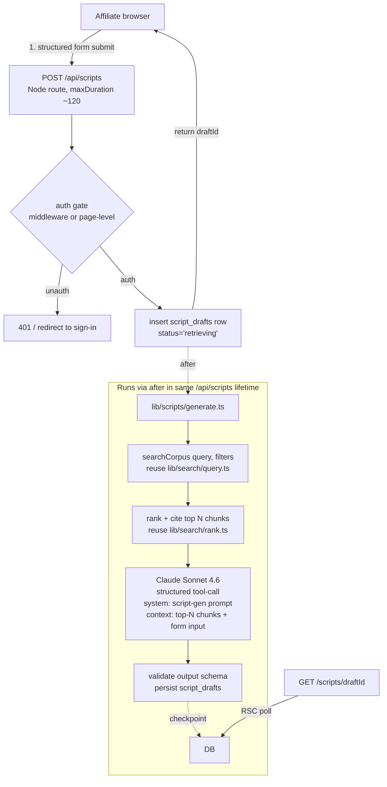

# skincare-scripter Phase 2 — Script Generator Plan

> **Status: planning doc, not a build spec.** Phase 2 has three load-bearing
> decisions (§2) that have to resolve before §6-§8 can be drafted concretely.
> The architecture and schema sketches in §3-§5 are parametric on those
> answers — they show both branches, not "the build." Once Cameron picks the
> branches, this doc gets a Slice 5.5-style "decisions locked" rewrite and the
> open questions retire to a history pointer (the way v0 PLAN's §10 did).

---

## 1. EXECUTIVE SUMMARY

**Goal.** The RAG-driven half the v0 corpus was built to feed. Affiliate
creators type a request (product, audience, framework, hook angle — exact
shape TBD per §2.3); the app retrieves the most relevant chunks from the
existing `corpus_chunks` corpus + a framework library, hands them to Claude
Sonnet 4.6, and returns a structured script draft.

**What carries over from v0 for free:**

- `corpus_chunks` corpus (videos + knowledge, unified table, hnsw cosine
  index, 1536d `text-embedding-3-small`)
- `search_corpus` RPC + `lib/search/{query,rank,trust}.ts` (filters compile
  away when null; ranker is pure and parameterized on the trust map)
- `source_trust` DB table + `/trust` admin
- Basic Auth proxy (`proxy.ts` — disposition is §2.4)
- Supabase project (`yajpzqbrclsxhljialqs`) + Vercel deploy
  (`skincare-scripter.vercel.app`) + GitHub auto-deploy
- Same model stack: Groq Whisper (ingestion only — script-gen is text-only),
  Claude Sonnet 4.6, OpenAI embeddings

**What's net-new:**

- Auth + users table (provider choice in §2.2)
- Multi-tenant data scoping (model choice in §2.1)
- Script-gen Claude prompt + tool schema (shape blocked on §2.3)
- Framework library ingestion (probably reuses knowledge pipeline — §6)
- `script_drafts` table + UI (versioning semantics in §7)
- Request form + result UI

**Footnote on v0 leftovers:** the v0 PLAN's `pipeline_runs` observability
table never shipped (not in migrations 0001-0009). Phase 2 should decide
whether to revive it for script-gen cost auditing or skip — not its own
question, just don't silently assume it exists.

---

## 2. OPEN QUESTIONS — RESOLVE BEFORE CODE

These are the spine. The slice plan (§8) can't be drafted until §2.1-§2.3
land. Numbered for back-reference.

### 2.1 Multi-tenancy model — *load-bearing*

The SPEC says: *"Ingestion is single-user (Cameron); the script generator
opens to affiliate creators."* Plain read: **shared corpus, per-user drafts.**
Affiliates query Cameron's corpus, can't add to it, can't see each other's
drafts. Naming the alternative so it's a rejection, not a silent inheritance:

| Branch | Corpus | Drafts | Ingestion |
|---|---|---|---|
| **A. Shared corpus (plain SPEC read)** | one corpus, all users query it | per-user, private | Cameron-only |
| **B. Per-affiliate corpus** | each affiliate has their own private corpus | per-user, private | each affiliate ingests |
| **C. Hybrid** | shared base corpus + optional per-affiliate "private notes" layer | per-user, private | Cameron + opt-in affiliate notes |

**Recommendation: A.** It matches the SPEC, it's the smallest build, and it
preserves Cameron's curatorial role (the whole reason v0 stayed single-user).
B turns this into a SaaS product, which SPEC explicitly punted to Phase 4.
C is a hedge — useful only if affiliates start asking for private notes,
which they haven't.

**What changes downstream:**
- A: no `owner_id` on `videos` / `knowledge_items` / `corpus_chunks`; only
  on `script_drafts`. Search RPC unchanged. Smallest schema delta.
- B: every existing table needs `owner_id` + RLS. The Slice 4-6 work
  (search RPC, rank pipeline) has to gain a tenant filter. Significantly
  larger blast radius.
- C: A + a nullable `owner_id` on `corpus_chunks` (null = shared, set =
  private). Filter pill toggles visibility.

### 2.2 Auth provider — *load-bearing*

| Option | Pros | Cons |
|---|---|---|
| **Supabase Auth** | Cameron has muscle memory from DBL Travel; same SDK already in app; cheapest; same project as the data. | Quirks already logged: [[feedback-supabase-auth-quirks]] (free-tier OTP rate cap 2/hr; direct-SQL user inserts need `''` token cols not NULL); magic-link prefetch issue [[feedback-email-link-prefetch]] means default to OTP, not magic links, if any invitee is on a corp domain. |
| **Clerk** | On Vercel Marketplace, one-click provisioning, drop-in `<SignIn />` UI, social logins out of the box. | Extra vendor; paid tier kicks in past free-tier MAU cap (verify current pricing before deciding — invite-only beta likely stays under the cap, so cost may be a non-issue at v1); JWT-to-Postgres mapping needs a Supabase function or trigger to keep `users` row in sync; an extra hop in the trust chain. |
| **Custom (passwordless + Supabase tables)** | Total control, no quirks except your own. | Reinventing rate limiting, email delivery (would need Resend), session management. Not recommended unless §2.1 is C and we need fine-grained scoping logic. |

**Recommendation: defer to Cameron.** Lean Supabase Auth on inertia + cost
unless he wants the Clerk affordances. If Supabase Auth: **use OTP codes,
not magic links** (per [[feedback-email-link-prefetch]] — affiliates on
corp domains will hit the prefetch problem and "expired link" loops are
a terrible first-touch).

**What changes downstream:**
- Supabase Auth: `users` table is `auth.users` + a `public.profiles` table
  with `target_creator_gender` and other defaults. RLS uses
  `auth.uid()`. Server actions read `await createServerClient()`.
- Clerk: bridge user to a `public.users` table via Clerk webhook
  (`user.created`); RLS uses a custom JWT claim, or scope at the app
  layer with the service role and trust the API gate.

### 2.3 Script input/output contract — *load-bearing*

Affects the Claude prompt, the request UI, and the `script_drafts` schema.
Open dimensions:

**Input shape:**
| Option | Affiliate provides |
|---|---|
| **Free-form prompt** | one text box: *"Hook for Medicube serum targeting men with adult acne"* |
| **Structured form** | brand + product + target audience + framework (Hormozi value-equation, etc.) + optional hook angle + `target_creator_gender` |
| **Hybrid** | structured form with a free-form "additional context" textarea |

Recommendation: **structured form**, because it's also what the retrieval
ranker needs — `brand`, `product_name`, `creator_gender`, `ai_tags`
already exist as filters on `search_corpus` and the form maps 1:1.
Free-form prompt forces a parsing step (LLM-call to extract structure)
that adds cost and a failure mode.

**Output shape:**
| Option | Returns |
|---|---|
| **Single script** | one draft, beats mirror breakdown schema (hook/problem/twist/solution/cta + tonality/pacing_notes) |
| **N variants** | 2-3 drafts in one request, different hook tactics |
| **Iterative refinement** | one draft + "regenerate hook" / "tighten CTA" buttons that re-call Claude with the prior draft as context |

Recommendation: **single script for Slice 1 → variants in a follow-up
slice**, mirroring v0's "smallest E2E first." Iterative refinement is
genuinely useful but doubles the prompt-design surface and can wait until
the first draft shape is proven.

**Script schema candidate** (mirroring breakdown.ts so retrieval results
align with output structure):

```ts
{
  hook: { text, tactic, why_it_works },           // no t_start/t_end — script is pre-production
  problem: { text, framing },
  twist: { text, tactic },
  solution: { text },
  cta: { text, style },
  tonality: string,
  pacing_notes: string,
  visual_direction: string,                       // new — what the creator should show
  ai_tags: string[],                              // for future filter / search of past drafts
  citations: [{ chunk_id, kind, text_excerpt }]   // which corpus chunks Claude leaned on
}
```

`citations` is the load-bearing add: it's how the affiliate (and Cameron)
can audit "did this draft actually come from real corpus material or did
Claude hallucinate." Likely a Slice 2 polish, not Slice 1 — but the
schema should accommodate it from day one.

### 2.4 `proxy.ts` disposition — *flagged in STATUS, decide as part of auth slice*

Cameron already framed this in STATUS:

> (a) keep `proxy.ts` as a coarse outer gate in front of real auth
> (defense in depth — friendly for a single-creator beta where only invited
> people have the password) or (b) removing it once the real auth surface
> is verified.

**Recommendation: (a) during invite-only beta, (b) when ready to onboard
without the shared password.** Practically: the auth slice keeps both
running; the cutover slice removes the proxy after the team validates
real auth works on prod (incognito test). Don't leave both running
silently past that — passwords leak.

### 2.5 `target_creator_gender` — *not open, just naming the design*

STATUS says request-time param "alongside a real users table." Plain
design: `profiles.default_creator_gender` enum (male/female/unknown, same
shape as `videos.creator_gender`), set on first sign-in or in account
settings; the request form pre-fills from the default but is editable
per-request. The Claude prompt receives whichever value the form
submitted, not what's stored on the profile.

### 2.6 Framework library — *open but lower-stakes*

| Option | Mechanics |
|---|---|
| **Reuse `knowledge_items`** | Frameworks land as `knowledge_items` rows with `source_label='Hormozi - $100M Offers'` etc.; retrieval lifts them via the existing search; no schema change. |
| **Dedicated `frameworks` table** | Adds beat-structure metadata (e.g. a Hormozi-style "value equation" has named stages); the prompt scaffolds against this structure. |

**Lean reuse for Slice 1.** A framework is functionally a knowledge item
with a trusted source_label — the source-trust table already lets us
weight it higher in the ranker. A dedicated `frameworks` table only earns
its weight if the prompt actually consumes structured beat metadata,
which would only matter if §2.3 went with "iterative refinement" (it's
deferred). Revisit if early script outputs feel like "Claude scattered
some Hormozi terms over a generic script" instead of "Claude applied a
specific framework."

### 2.7 Pricing / rate-limiting — *open, blocks model choice*

| Option | Implication |
|---|---|
| **Invite-only beta, Cameron eats cost** | Sonnet 4.6 is fine; no rate limits beyond per-user request log. |
| **Open access** | Need rate limits (per-user-per-day caps), and Sonnet 4.6 + variants gets expensive — consider Haiku 4.5 for variant generation, Sonnet for the primary draft. |

**Recommendation: invite-only beta for v1.** Defers all the
rate-limiting infrastructure. Real model: same as v0 (Sonnet 4.6 for
analysis quality).

### 2.8 Performance feedback (Phase 3) is NOT in scope

The SPEC's `corpus_chunks.metadata` jsonb was *designed* for Phase 3
performance feedback (stamping `creator_engagement` post-publish, then
reweighting retrieval). **Don't bleed Phase 3 into Phase 2** —
specifically: don't add a `metadata.creator_engagement` field to any new
schema; don't add a "draft → published → engagement" loop. The hook
exists; Phase 3 will land on it.

### 2.9 Lower-stakes decisions to make alongside Slice 1 — *surfaced by pre-Phase-2 code audit (2026-05-17)*

Three smaller decisions that don't block planning but should land before
script-gen retrieval ships:

- **Ranker RAG-mode.** `lib/search/rank.ts` has one scoring formula tuned
  for the interactive `/search` UI (similarity + recency + virality +
  trust). Phase 2 RAG calls the same `searchCorpus()`. Question: is the
  search-tuned formula fine for RAG retrieval (recommended — brand /
  product / gender filtering already does the heavy lifting), or does
  RAG need a `mode: 'search' | 'rag'` parameter with different weights
  (e.g. trust-only for knowledge chunks, no virality for B-roll)?
  **Defer to first script-gen output review** — don't refactor preemptively.
- **brand / product / creator_gender denorm into `corpus_chunks.metadata`.**
  Pipeline currently denormalizes only `niche_tag`, `view_count`,
  `creator_handle` into chunk metadata (matches what PATCH propagates).
  `brand`, `product_name`, `creator_gender` live only on the parent
  `videos` row, fetched fresh on every search via the `search_corpus`
  RPC's LEFT JOIN. This is correct for the RPC path. **Only revisit if**
  Phase 2 grows a code path that reads chunks without joining `videos`
  (e.g. citation rendering that wants brand inline) — at that point,
  either extend denorm + PATCH propagation, or do the join.
- **Revive `pipeline_runs` observability for script-gen cost auditing?**
  Specced in v0 PLAN §2, never shipped. Script-gen is a single Claude
  call per draft, so per-row spend is easy to estimate ahead-of-time
  without a tracking table. **Recommendation: skip for Slice 1**, revisit
  if cost auditing becomes a real ask (e.g. if Phase 2 grows variants
  or refinement and Claude usage stops being O(1) per request).

---

## 3. ARCHITECTURE — PARAMETRIC ON §2.1

### Branch A (recommended — shared corpus, per-user drafts)



**Where Phase 2 differs structurally from v0:**

- No long-running pipeline — script gen is single-shot Claude call after
  retrieval; ~10-30s end-to-end. No `after()` needed unless we add
  variants/refinement (Slice 2+).
- No new external services for generation (Claude, OpenAI embeddings, and
  Supabase are already wired). Auth is the only net-new dependency.
- Search reuse is total: `lib/search/query.ts` takes a query string + filter
  object and returns ranked results. Phase 2 calls it with the structured
  form values as filters and one of `{product, brand, hook angle, free-form
  context}` as the query string — TBD which composition wins per §2.3.

### Branch B (per-affiliate corpus)

Every diagram changes. Search needs a tenant filter (RLS or app-layer scope
check); ingestion pages need affiliate auth; the Cameron-curated corpus
either disappears or becomes a "shared library" overlay (which collapses
into Branch C). **Not drafting this in detail unless Cameron picks it.**

---

## 4. SCHEMA ADDITIONS — PARAMETRIC ON §2.1 + §2.2

Migration `0010_phase2_auth_and_scripts.sql` (Branch A + Supabase Auth):

```sql
-- §2.5 + §2.2: user profile, one row per auth.users.id
create table profiles (
  id uuid primary key references auth.users(id) on delete cascade,
  display_name text,
  default_creator_gender creator_gender not null default 'unknown',
  is_admin boolean not null default false,        -- gates /trust, /upload, /knowledge
  created_at timestamptz not null default now()
);

-- §2.3: script drafts
create type script_status as enum (
  'retrieving', 'generating', 'completed', 'failed'
);

create table script_drafts (
  id uuid primary key default gen_random_uuid(),
  owner_id uuid not null references auth.users(id) on delete cascade,
  status script_status not null default 'retrieving',
  -- request inputs (structured form per §2.3)
  brand text,
  product_name text,
  target_audience text,
  framework_label text,                            -- e.g. 'Hormozi - $100M Offers'
  hook_angle text,
  additional_context text,
  target_creator_gender creator_gender not null,
  -- output
  script jsonb,                                    -- shape per §2.3 candidate
  citations jsonb,                                 -- [{ chunk_id, kind, text_excerpt }]
  model text,
  raw_claude_response jsonb,
  error_message text,
  created_at timestamptz not null default now(),
  updated_at timestamptz not null default now()
);
create index on script_drafts (owner_id, created_at desc);
create index on script_drafts (status);

-- RLS: each user sees only their drafts; admins see all
alter table script_drafts enable row level security;

create policy "users read own drafts" on script_drafts
  for select using (auth.uid() = owner_id
                  or exists (select 1 from profiles where id = auth.uid() and is_admin));
create policy "users write own drafts" on script_drafts
  for insert with check (auth.uid() = owner_id);
create policy "users update own drafts" on script_drafts
  for update using (auth.uid() = owner_id);

-- Existing tables (videos, knowledge_items, corpus_chunks) stay un-scoped
-- per Branch A — shared corpus is intentional. If we ever switch to
-- Branch B, that's a separate migration with owner_id backfill + RLS.
--
-- READ-ACCESS POSTURE under Branch A + Supabase Auth: existing tables
-- stay RLS-disabled. The service role still does all pipeline writes
-- (unchanged from v0). Any authenticated user can read all videos /
-- knowledge_items / corpus_chunks via the standard server client —
-- that IS the shared-corpus design, not an oversight. Ingestion routes
-- (POST /api/videos, /api/knowledge, /api/uploads/sign*, retry routes)
-- and admin pages (/upload, /knowledge, /trust) are gated separately
-- by checking profiles.is_admin in the API route + page, since RLS on
-- Storage uploads is awkward.

-- Lock down the ingestion routes via profiles.is_admin checked in the
-- API route — not in RLS, because RLS on Storage uploads is awkward.
```

**If Branch B:** add `owner_id uuid not null references auth.users(id)` to
`videos`, `knowledge_items`, `corpus_chunks` (+ backfill Cameron's user id);
add RLS using `auth.uid() = owner_id`; extend `search_corpus` RPC to filter
on the caller's user id; the `/trust` admin becomes per-user. Significant.

**If Clerk instead of Supabase Auth:** `profiles.id` becomes `text` (Clerk
user IDs are strings); RLS policies switch to a JWT custom-claim check; a
Clerk webhook handler at `app/api/webhooks/clerk/route.ts` upserts the
`profiles` row.

---

## 5. RAG RETRIEVAL FLOW

Mostly settled — described as "what reuses" rather than "what to build":

1. `searchCorpus(query, filters)` from `lib/search/query.ts` is called with:
   - `query` = composed from form input (candidate composition: `${brand}
     ${product_name} ${hook_angle ?? ''} ${target_audience ?? ''}`).
     Empirically tunable — start with concat, iterate if recall is poor.
   - `filters` = `{ creatorGender: target_creator_gender, brand, productName,
     ... }`. The existing filters compile away when null.
2. Top-k tuning (currently 30 → top 10 post-rank). For script gen, may want
   to keep more (15-20) so the prompt has richer grounding. **Tunable
   parameter, not a schema change** — set in `lib/scripts/generate.ts`.
3. **Trust weighting matters more for script gen than search.** A Hormozi
   chunk vs. Cameron's personal notes should land at very different weights
   in the prompt. The existing `source_trust` table already does this; might
   warrant a Phase 2 pass to actually populate it with real weights (Slice
   in §8). The `/trust` admin is the lever.
4. **Citation:** retrieved chunks get a stable `chunk_id` passed into the
   Claude prompt; Claude is told to cite which `chunk_id` informed each beat
   in its tool output. Server-side validates that every cited `chunk_id`
   came from the actual retrieved set (no hallucinated IDs). This drops
   directly into `script_drafts.citations`.

---

## 6. SCRIPT-GEN CLAUDE PROMPT — SKETCH

Concrete prompt waits on §2.3 resolution. Shape will look like:

```ts
const SYSTEM_PROMPT = `You are an expert short-form video scriptwriter for the
personal-care and skincare niche. You write scripts grounded in real viral
examples and proven persuasive frameworks, NOT generic advice.

The creator you are writing for has provided:
- Brand, product, target audience
- Optional framework (e.g. Hormozi value equation)
- Optional hook angle
- Their gender (the script must feel natural for a {male|female} presenter)

You will receive a set of GROUNDING CHUNKS from a curated corpus:
- Some are transcripts/breakdown excerpts from viral skincare TikToks
- Some are pages/excerpts from books or framework documents
Each chunk has a chunk_id you MUST cite when its content informed a beat.

Write ONE script with the structure: hook, problem, twist, solution, CTA.
Match the tactics and tonality of the highest-trust grounding chunks. Do not
invent product claims not present in the grounding chunks. If the grounding
chunks don't support a beat, mark it [NEEDS CREATOR INPUT] rather than
inventing.

Call submit_script exactly once.`;
```

Tool schema mirrors the §2.3 candidate. Hallucination guard via citation
validation (server checks every `cited_chunk_id` ∈ retrieved set).

**Open prompt-design questions, deferred until first runs:**

- Whether to include `breakdowns` rows directly in the prompt (high signal,
  expensive in tokens) or just `corpus_chunks` excerpts (uniform, cheaper).
- How to format the framework grounding — verbatim chunks vs.
  pre-summarized.
- Whether `gender_specific_notes` chunks should be retrieval-boosted when
  `target_creator_gender` is set.

These are tunable post-Slice-1, not blockers.

---

## 7. DRAFT STORAGE / VERSIONING

**Slice 1 decision: one draft = one row, no versioning.** Affiliate types
form, submits, sees draft. To iterate, submit again — new row. Simple,
defers the editing/versioning surface entirely.

**Open questions (defer):**

- Should drafts be editable inline by the affiliate (favorite phrasings,
  tweaks)?
- Should regenerate-single-beat be possible (would need a `parent_draft_id`
  or `revisions jsonb` column)?
- Should drafts ever be deletable, or is the log permanent?

Mark these as Slice 2+ — Slice 1 ships read-only drafts.

---

## 8. SLICE PLAN — placeholder

**Cannot be drafted concretely until §2.1, §2.2, §2.3 resolve.** Sketch
assumes Branch A + Supabase Auth + structured form + single-draft output —
revise once the open questions land:

| # | What ships (provisional) |
|---|---|
| 1 | Smallest E2E: Supabase Auth (OTP-code), `profiles` + `script_drafts` migration, single structured form → single script draft → render. proxy.ts stays as outer gate. **Plus: retrofit `profiles.is_admin` gates onto every existing ingestion/admin surface** — pages `/upload`, `/knowledge`, `/trust`, and API routes `POST /api/videos`, `POST /api/knowledge`, `POST /api/uploads/sign`, `POST /api/uploads/sign-knowledge`, both retry routes, `PATCH /api/videos/[id]`, `/trust` writes. **Plus: fold in the pre-Phase-2 audit findings** (raw-error leakage, stack-trace truncation, posted_at validation, admin-client cleanups, rate limiting, type generation, `app/error.tsx`, `parseSearchParams` helper) — full list with file:line refs in `STATUS.md` § "Pre-Phase-2 audit findings". That's the real Slice 1 size — auth retrofit + audit cleanup is bigger than the script-gen surface itself. Consider splitting if it bloats. |
| 2 | Citations: persist + render which chunks informed which beats. Trust-table tuning pass (Cameron sets real weights via `/trust`). |
| 3 | Variants: 2-3 drafts per request, different hook tactics. May warrant Haiku 4.5 for the secondary variants per §2.7. |
| 4 | Iterative refinement: "regenerate hook" / "tighten CTA" buttons that re-call Claude with prior draft as context. |
| 5 | proxy.ts removal slice: incognito-test real auth on prod, then remove the proxy. (Per §2.4.) |

Slice 1 ship criterion analogue to v0 Slice 1: an authenticated affiliate
submits the form, sees a structured script rendered, and Cameron (admin)
can see the draft in the database.

---

## 9. LOCAL DEV / OPERATIONS NOTES

- **Don't pull secrets via `vercel env pull` in agent sessions.** Hard
  rule per [[feedback-never-pull-secrets-in-agent-session]] — the harness
  echoes file writes to the transcript. Anything new (auth provider keys,
  Clerk webhook secret, etc.) gets added via the Vercel dashboard, and
  `.env.local` gets the same values copied by hand outside the agent.
- **Vercel Pro Standard Protection still doesn't gate the production alias**
  per [[feedback-vercel-standard-protection-alias-gap]] — that's why
  `proxy.ts` exists. Don't try to re-enable Vercel Authentication thinking
  it'll work; it won't on Pro. App-level auth is the only real gate.
- **Supabase Auth gotchas if Branch chosen:** OTP codes not magic links
  (per [[feedback-email-link-prefetch]]); be aware of the free-tier 2/hr
  OTP rate cap during testing (per [[feedback-supabase-auth-quirks]]).
- **`pipeline_runs` cost auditing was specced in v0 PLAN §2 but never
  shipped** (not in migrations 0001-0009). Phase 2 should decide whether
  to revive it for script-gen cost auditing or skip — script gen is a
  single Claude call so spend is much easier to estimate ahead-of-time
  than the v0 pipeline.

---

## 10. UPDATING THIS FILE

Once §2.1, §2.2, §2.3 resolve, this doc gets a Slice-5.5-style top banner
("§2 resolved 20YY-MM-DD — Branches A + Supabase Auth + structured form
locked, see STATUS.md for slice status"), §2 collapses to a history pointer,
and §3-§5 become single-branch concrete instead of parametric. The slice
plan in §8 gets real ship criteria. Then this doc is read like v0 PLAN was
during Slices 1-7.
